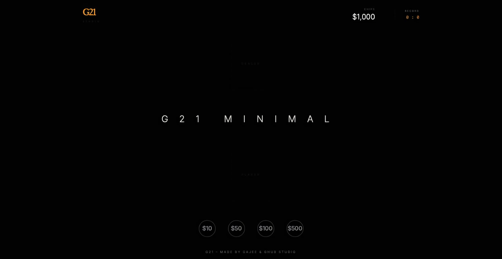
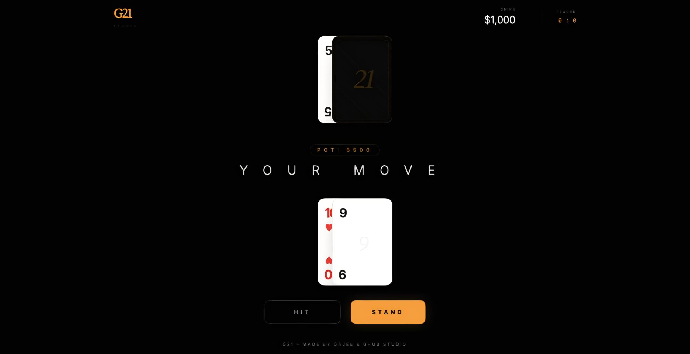
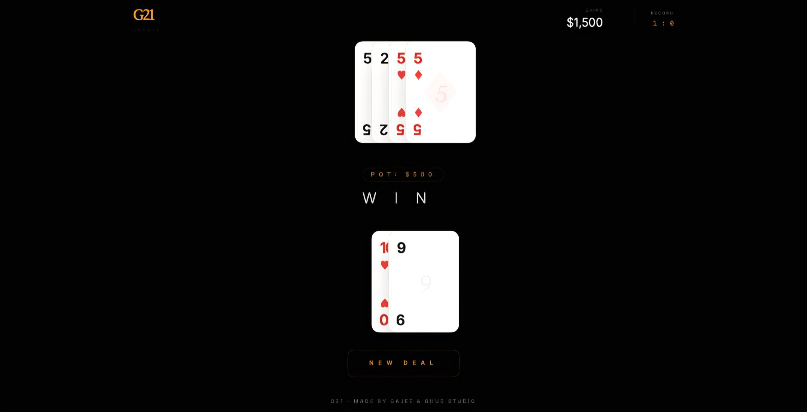

<h1 align="center" style="color: orange;">G21 | Minimal Blackjack</h1>
<p align="center" style="color: #ff7f00;">**Developed by Gajee & Ghub Studio**</p>

<p align="center">
  A premium, minimalist Blackjack experience for single-player elegance. No noise, no ads—just the game.
</p>

---

## 📸 Screenshots

<p align="center">
  
</p>
<p align="center">
  
</p>
<p align="center">
  
</p>

---

## 🖥️ Installation

### macOS (PWA)
1. Open G21 in **Safari**.
2. Select **File > Add to Dock...**.
3. Name it **"G21"** to add it to your Dock.

### Windows
1. Open G21 in **Edge** or **Chrome**.
2. Click the **"Install App"** icon in the address bar.
3. Click **Install** to pin it to your Start Menu or Taskbar.

### Android (APK & Home Screen)
#### Option 1: Instant Install (Recommended)
1. Open G21 in **Chrome** on your Android device.
2. Tap the **"Add to Home screen"** prompt or select **"Install app"** from the menu.
3. G21 will appear in your App Drawer.

#### Option 2: Generate APK
1. Visit [PWABuilder.com](https://www.pwabuilder.com/).
2. Enter the URL of G21, then download the APK.

---

## 🛠 Developer Setup

1. Install **Node.js** from [nodejs.org](https://nodejs.org/).
2. Run the following commands:
   ```bash
   npm install
   npm start
Access the game at http://localhost:3000.
<p align="center">
💡 Credits
<p align="center" style="color: #ff7f00;"> G21 – Created with luxury, clarity, and minimalist aesthetics by Gajee & Ghub Studio.
</p> <p align="center">  </p> 
